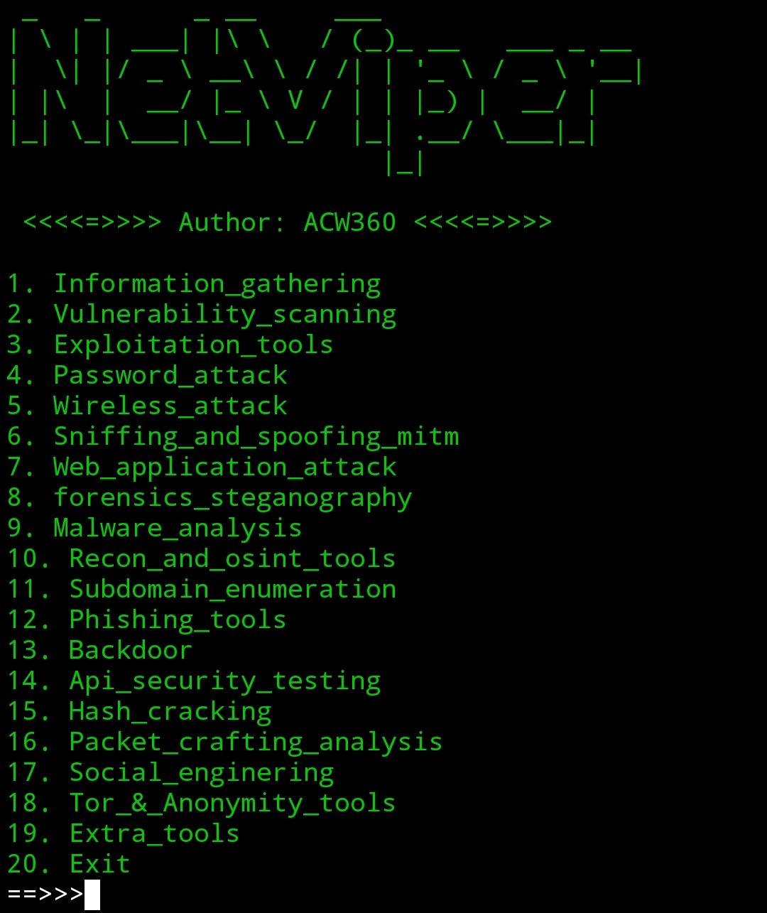

# 🕸️ NetViper - Cybersecurity Toolkit 🐍


**NetViper** is an all-in-one, powerful ethical hacking and penetration testing toolkit built with Python. It provides automated installation and quick access to over **80+ cybersecurity tools**, ranging from Information Gathering to Wireless Attacks, Password Cracking, and more!


## 🚀 Features

NetViper comes with the following categories and tools:

### 🧠 Information Gathering
- Nmap
- WhatWeb
- Shodan
- Wafw00f
- Sublist3r
- Urlscan
- HTTPX
- Arjun
- XSStrike

### 🔍 Vulnerability Scanning
- Nmap
- Wapiti3
- Dnstwist
- Urlscan
- Nikto

### 💥 Exploitation Tools
- Sqlmap
- Metasploit
- RouterSploit

### 🔓 Password Attacks
- Online: Hydra, Medusa, Patator, Ncrack, BruteSpray, Crunch
- Offline: Hashcat, John, Ophcrack, RarCrack, fcrackzip

### 📡 Wireless Attacks
- Aircrack-ng, Wifite, Reaver, Pixiewps, Bettercap, Kismet
- Hostapd, MDK4, Cowpatty, Fern WiFi Cracker, Scapy, Wifi-Honey

### 🕵️ Sniffing & Spoofing (MITM)
- Wireshark, Tshark, Ettercap, Bettercap, Dsniff
- MITMf, Responder, Nmap, Scapy, Pypcap, Mitmproxy, Faker

### 🌐 Web Application Attacks
- ZAP Proxy, Nikto, Wfuzz, Skipfish, Burpsuite
- WhatWeb, Dirb, Gobuster, Hydra, Sqlmap, Arjun

## 📷 Demo


## 🔧 Installation

```bash
git clone https://github.com/ACW360/NetViper.git
cd NetViper
python3 netviper.py
